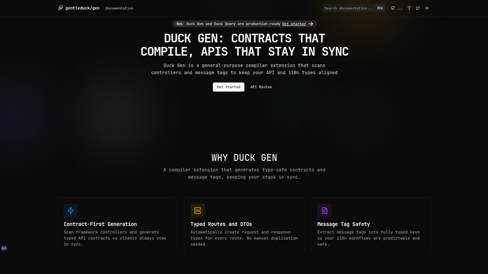

<p align="center">
  
</p>

# gentleduck/gen

Type-safe API and message code generator for TypeScript — compiler tooling, docs, and related packages.

## Documentation
- Docs app: `apps/duck-gen-docs`
- Live site: https://gen.gentleduck.org
- GitHub: https://github.com/gentleeduck/duck-gen

## Workspace Matrix

### Apps

| Path | Package | Role | Status |
| --- | --- | --- | --- |
| `apps/duck-gen-docs` | `@gentleduck/gen-docs` | Public docs site | Active |

### Published Packages

| Path | Package | Role | Status |
| --- | --- | --- | --- |
| `packages/duck-gen` | `@gentleduck/gen` | Type-safe API route and message code generator CLI | Active |
| `packages/duck-query` | `@gentleduck/query` | Type-safe Axios client paired with Duck Gen route maps | Active |
| `packages/duck-ttest` | `@gentleduck/ttest` | Zero-runtime TypeScript type-level test framework | Active |

### Private / Internal Packages

| Path | Package | Role | Status |
| --- | --- | --- | --- |
| `packages/ui` | `@gentleduck/ui` | UI component library (local workspace) | Private, active |
| `packages/sandbox-server` | `@gentleduck/sandbox-server` | Backend server for testing (tRPC, Hono, Drizzle) | Private, active |
| `packages/duck-skitch` | `duck-skitch` | Placeholder package | Private |

### Tooling Packages

| Path | Package | Role | Status |
| --- | --- | --- | --- |
| `tooling/biome` | `@gentleduck/biome-config` | Shared Biome config | Internal |
| `tooling/github` | `@gentleduck/github` | GitHub/project automation support | Internal |
| `tooling/tailwind` | `@gentleduck/tailwind-config` | Shared Tailwind config | Internal |
| `tooling/tsdown` | `@gentleduck/tsdown-config` | Shared `tsdown` config | Internal |
| `tooling/typescript` | `@gentleduck/typescript-config` | Shared TypeScript config | Internal |
| `tooling/vitest` | `@gentleduck/vitest-config` | Shared Vitest config | Internal |
| `tooling/bash` | `bash` | Shell utilities and misc scripts | Internal |

## Getting Started
```bash
git clone https://github.com/gentleeduck/duck-gen.git
cd duck-gen
bun install
```

## Run a Single App
```bash
bun --filter @gentleduck/gen-docs dev
```

## Common Workspace Commands
```bash
bun run dev          # run all workspace dev tasks
bun run build        # build all packages/apps
bun run test         # run tests across workspaces
bun run check        # biome checks
bun run check-types  # TypeScript type checks
bun run ci           # non-mutating repo verification (check, workspace lint, types, tests, build)
```

## Contributing
We welcome contributions. Please read [`CONTRIBUTING.md`](./CONTRIBUTING.md) and [`CODE_OF_CONDUCT.md`](./CODE_OF_CONDUCT.md).

## License
MIT. See [`LICENSE`](./LICENSE) for more information.
