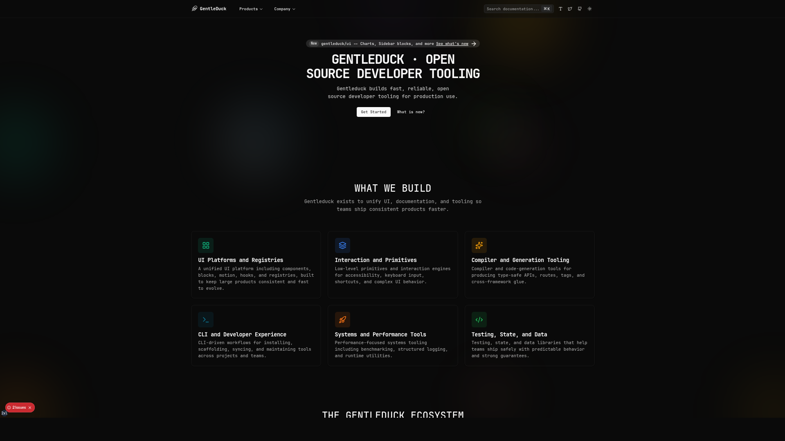

<p align="center">
  
</p>

# @gentleduck/duck-gen-docs

Next.js documentation site for Duck Gen, the compiler extension that keeps API routes and message tags aligned across frameworks.
## Quick Start
```bash
bun run --filter @gentleduck/gen-docs dev:docs
bun run --filter @gentleduck/gen-docs dev
```

## Scripts
- `bun run --filter @gentleduck/gen-docs dev` – run the dev server
- `bun run --filter @gentleduck/gen-docs build` – production build
- `bun run --filter @gentleduck/gen-docs start` – serve the build
- `bun run --filter @gentleduck/gen-docs dev:docs` – watch/generate MDX content
- `bun run --filter @gentleduck/gen-docs build:docs` – one-time MDX build
- `bun run --filter @gentleduck/gen-docs lint` – lint

## Environment
- `.env` is optional; see `.env.example` for defaults.
